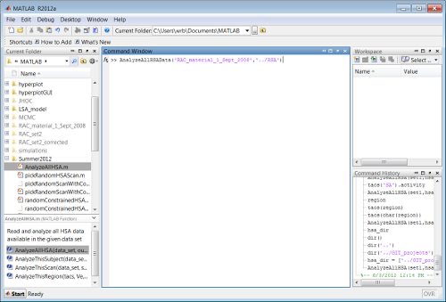
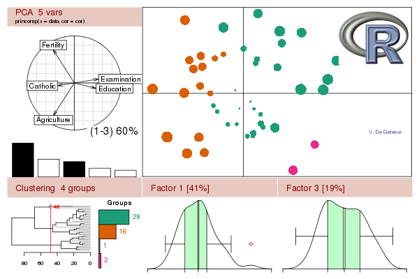
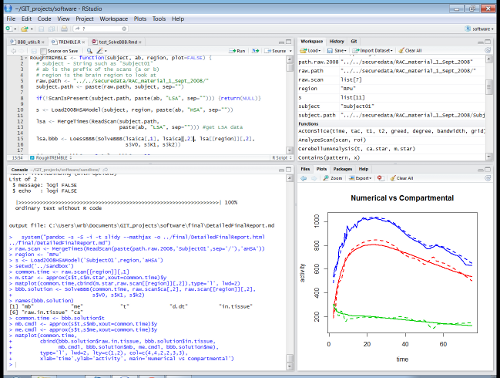

% Finding $m_e$ and $m_b$ Numerically in HSA and LSA Data
% Sasha Bauer
% 31/07/12

```{r setup, include=FALSE}
# set global chunk options
opts_chunk$set(fig.path='figure/detail-', cache.path='cache/detail-', cache=F)
for(n in list.files("./", pattern="\\.R$")) source(file.path("./", n))
```

---

# Executive Summary
- Can Solve BBB Numerically
- Solutions Match Compartmental Model on HSA
- Works on LSA
- Qualifications

---

# Can Solve BBB Numerically
- Given the constants $V_0$, $K_1$, and $k_2$, 
- I can solve the blood-brain barrier equation,
$$\frac{d}{dt}(m^* - V_0 c^*_a) = K_1 c^*_a - k_2 m_e$$
- and the mass-balance equation.
$$m_e + m_b = m^* - V_0 c^*_a$$
- For $m_e$ and $m_b$, no other equations are necessary.

---

# Solutions Match Compartmental Model on HSA
- For HSA data, my results approximate compartmental model results.
- Also applies to LSA.

```{r compartmental, message=FALSE, echo=FALSE}
plotBBBwithLSA <- function(subject)
{
  subject <- paste("../securedata/RAC_material_1_Sept_2008", subject,
                   sep="/")
  region <- "RPu"
  
  hsa.scan <- MergeTimes(ReadScan(subject, 'aHSA'))
  lsa.scan <- MergeTimes(ReadScan(subject, 'aLSA'))
  
  s <- Load2008HSAModel(basename(subject), region, 'aHSA')
  
  hsa.bbb.solution <- SolveBBB(hsa.scan$ca[, 1], hsa.scan$ca[, 2],
                               hsa.scan[[region]][, 2], s$V0, s$K1, s$k2)
  
  hsa.bbb.solution <- LoessBBB(hsa.bbb.solution)
  
  
  lsa.bbb.solution <- SolveBBB(lsa.scan$ca[, 1], lsa.scan$ca[, 2],
                               lsa.scan[[region]][, 2], s$V0, s$K1, s$k2)
  
  lsa.bbb.solution <- LoessBBB(lsa.bbb.solution)
  
  model.me <- approx(s$t, s$me, xout=hsa.bbb.solution$t)$y
  model.mb <- approx(s$t, s$mb, xout=hsa.bbb.solution$t)$y
  
  
  matplot(hsa.bbb.solution$t, cbind(hsa.bbb.solution$raw.in.tissue,
                                    hsa.bbb.solution$in.tissue.loess,
                                    model.mb, hsa.bbb.solution$mb.loess,
                                    model.me, hsa.bbb.solution$me.loess)/s$SA,
          type = "l", lwd = 2, lty = c(1, 3, 2, 3, 2, 3), col = c(4, 4, 2, 2, 3, 3),
          xlab = "time", ylab = "pmol/ml",
          main = paste("Numerical vs Compartmental\n",
                       basename(subject), " aHSA ",
                       region, sep=""))
  
  legend("topright", lwd=2, lty=c(1, 3, 2, 3, 2, 3), col=c(4, 4, 2, 2, 3, 3), legend=c("Raw Tracer in Tissue", "Numerical Estimate", "Compartmental me", "Numerical me", "Compartmental mb", "Numerical mb"))
  
  matplot(lsa.bbb.solution$t, cbind(lsa.bbb.solution$raw.in.tissue,
                                      lsa.bbb.solution$in.tissue.loess,
                                      lsa.bbb.solution$mb.loess,
                                      lsa.bbb.solution$me.loess)/lsa.scan$SA,
            type='l', lwd = 2, lty = c(1, 2, 2, 2), col = c(4, 4, 2, 3),
            xlab = "time", ylab = "pmol/ml",
            main = paste("Numerical\n",
                         basename(subject), " aLSA ",
                         region, sep=""))
  legend("topright", lwd=2, lty=c(1, 2, 2, 2), col=c(4, 4, 2, 3), legend=c("Raw Tracer in Tissue", "Numerical Estimate", "Numerical me", "Numerical mb"))
}
```

<div class="incremental">
```{r modelsub1, message=FALSE, echo=FALSE}
plotBBBwithLSA("Subject01")
```
</div>

---

# Additional Examples

```{r modelsub2, message=FALSE, echo=FALSE}
plotBBBwithLSA("Subject02")
```

---

# Additional Examples

```{r modelsub3, message=FALSE, echo=FALSE}
plotBBBwithLSA("Subject03")
```

---

# Additional Examples

```{r modelsub4, message=FALSE, echo=FALSE}
plotBBBwithLSA("Subject04")
```

---

# Additional Examples

```{r modelsub5, message=FALSE, echo=FALSE}
plotBBBwithLSA("Subject05")
```

---

# Qualifications
- Outliers remain to be examined
- Beginnings and ends can probably be fixed
- Have had no time for data sets two and three
- Still using prototyping tool, *locpoly*
- Should port the compartmental analysis to R

---

# "TREMBLE"
1. In Matlab, do compartmental analysis for HSA
2. Assume $V_0$, $K_1$, $k_2$ are the same for HSA and LSA
3. In R, solve LSA case using my techniques
4. Combine results to get $B^\prime _{max}$ and $K_D$ ($K_M$)

--- 

# $B^\prime_{max}$ vs. $K_D$

```{r scatterplot, message=FALSE, echo=FALSE, fig.cap=""}
region <- "RPu"  # arbitrary
a.segments <- b.segments <- NULL
sep = "0"
for(n in 1:21){
  if(n > 9)sep=""
  subject <- paste("Subject",n,sep=sep)
  temp <- try(RoughTREMBLE(subject, "a", region, plot=F))
  a.segments <- rbind(a.segments,temp)
  temp <- try(RoughTREMBLE(subject, "b", region, plot=F))
  b.segments <- rbind(b.segments,temp)
  }

a.segments <- a.segments[c(1:7,10),]

# Set up the scale and labels. (The as.matrix hack is to avoid R complaints
# about column names.)
plot(rbind(a.segments[,3:4],
           b.segments[,3:4]),
     type='n',
     xlab='KD', ylab='Bmax (pmol/ml)', 
     main="RPu")
# Points distinguishable by shape and fill in case of color blindness.
points(a.segments[,3:4],col=4,pch=21,bg=4)
points(b.segments[,3:4],col=2,pch=22)
```

---

# Technology
- Matlab
- R
- RStudio
- Local Polynomial Fitting

---

# Matlab



---

# R
- "*R is a free software environment for statistical computing and graphics.
Runs on a wide variety of UNIX platforms, Windows and MacOS.*"

<div class="incremental">

</div>

---

# RStudio
Rstudio is an open-source IDE for R



# Local Polynomial Fitting (*locpoly*)
- Approximate data by polynomial "locally" and differentiate
- "Locally" means nearby errors are weighted more heavily
- "Weighting" varies with time
- The weighting schedule has been customized for PET data
